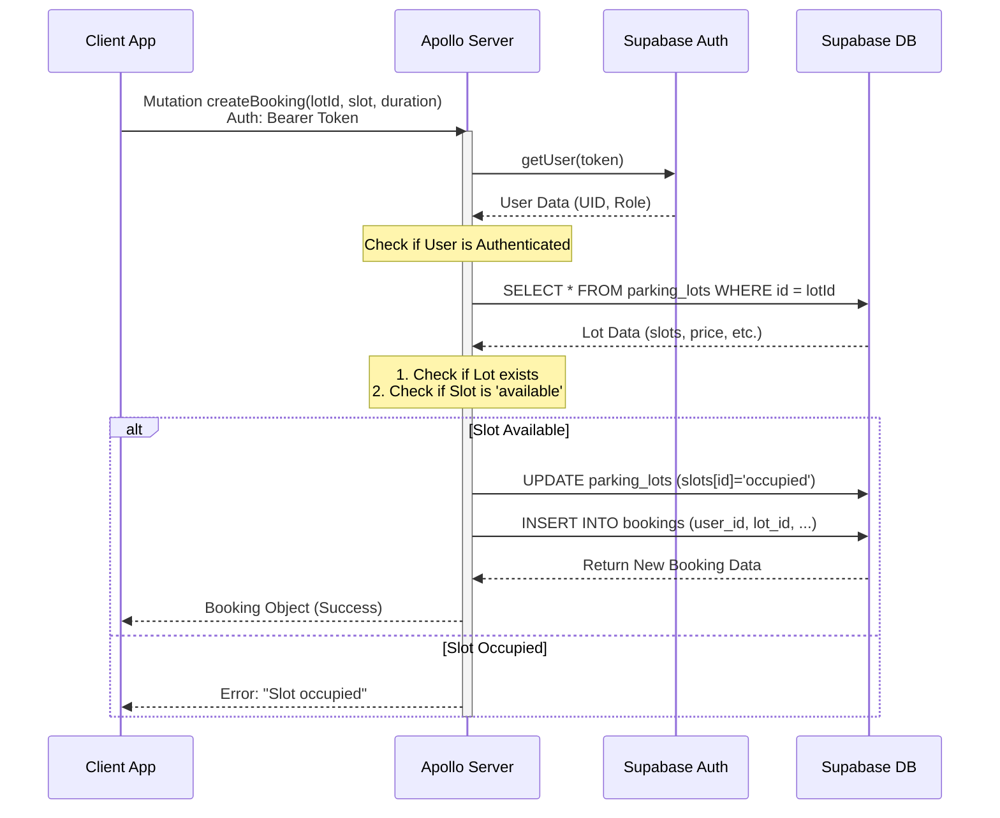

# Project Flow & Architecture

## 1. High-Level Architecture
This project is a **Serverless GraphQL API** built to run on **Vercel**. It bridges a Frontend application with a **Supabase** backend (PostgreSQL + Auth).

- **Runtime**: Node.js (via `@vercel/node`)
- **Framework**: Express + Apollo Server
- **Language**: TypeScript
- **Database & Auth**: Supabase
- **Deployment**: Vercel Serverless Functions

## 2. Request Data Flow
Every request follows this path:

1.  **Client** sends HTTP POST to `/graphql`.
    - Headers: `Authorization: Bearer <SUPABASE_TOKEN>`
2.  **Vercel** routes traffic to `api/src/index.ts`.
3.  **Authentication Middleware** (`index.ts`):
    - Intercepts request.
    - Validates token with `supabase.auth.getUser()`.
    - Attaches `user` object (UID, email, role) to the GraphQL Context.
4.  **Apollo Server**:
    - Matches request to **Schema** (`schema.ts`).
    - Executes corresponding **Resolver** (`resolvers.ts`).
5.  **Resolver Logic**:
    - Checks permissions (e.g., `if (!user) throw ...`).
    - Queries/Updates **Supabase Database** tables (`profiles`, `parking_lots`, `bookings`).
6.  **Response**: JSON result returned to Client.

## 3. Sequence Diagram: Creating a Booking
This diagram illustrates the flow when a user creates a booking, involving validation and database updates.



## 4. Development Workflow

### Prerequisites
- Node.js
- Supabase Project credentials

### Setup
1.  **Install Dependencies**:
    ```bash
    cd api
    npm install
    ```
2.  **Environment Variables**:
    Ensure `api/.env` contains your Supabase credentials:
    ```env
    SUPABASE_URL=...
    SUPABASE_ANON_KEY=...
    ```

### Running Locally
To start the development server:
```bash
cd api
npm run dev
# Server runs at http://localhost:4000/graphql
```

### Deployment
Deployment is handled by **Vercel** based on `vercel.json`.
```bash
vercel deploy
```
